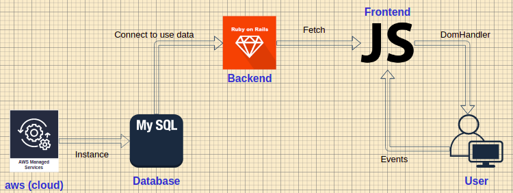

# Ecommerce app (bsale)

Features:

    Backend
      Language: Ruby
      Database: Mysql
      Datbase on cloud: AWS

    Frontend
      Language: Javascript

    Helpers
      Bootstrap
      SweetAlert

## Backend

For the backend part, the api was build using RoR based on Ruby, and the database used was Mysql which connects with the datababase of BSALE in aws.

    Here, the controller of Product return all products filtered by the category.

      Example of the return:

      [
        {
          "id": 7,
          "name": "vodka",
          "products": [
            {
              "id": 104,
              "name": "ABSOLUT",
              "url_image": "https://dojiw2m9tvv09...png",
              "price": 8990.0,
              "discount": 30,
              "category": 7
            }
          ]
        }
      ]

    The api used entorn variables to connect with the database, because always is important to take care with the credentials of db.

You can visit the api in the following link:

https://products-by-category.herokuapp.com/

## Frontend

For the frontend part, the UI/UX was build in Js(vanilla) using bootstrap and sweetalert for some components.

    In this part the distribution of files and directories are easy to understand because the they were named in the same way as the components of functionality.

      For Example:
        on ./scripts/helpers/capitalize.js, the file is name capitalize, because it is the helper of the capitalization of the name of the product.

    The distribution of files are similar to frameworks like React, Angular, Vue.js and its to easy to understand.

The result of the frontend is a website that can be seen in the following link:

/put link/

    For the user experience, the web site use Listeners of DOM to manage the interaction between the user and the website.

## Diagram
 

    The diagram is a simple diagram of the structure of the project.

    The structure of the project is:
    
    * Mysql instance in aws.

    * Ruby on Rails connect wit the database using the credentials of the aws.

    * Backend API using RoR, return all products filtered by the category.

    * Frontend UI/UX using Js(vanilla), get the data from the backend API using FETCH(api for js to make HTTP requests) and show it in the website.

    * Helpers of the frontend, like the capitalization of the name of the product.

## How it works

    The app is a online store where you can add products on your cart (it doens't have a pay methods), and you can see the products filtered by the category and oferts. Also you can search any product by its name.

The result of the frontend is a website that can be seen in the following link:

https://david-rivas-store1.herokuapp.com/

  
### Ready, you can enjoy!

  

*Made by Monito Inc. 🙊*

